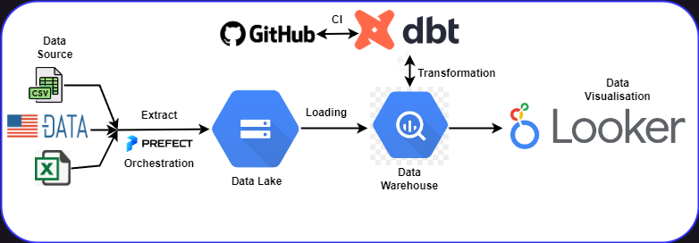

# ELT Data Engineering Project- 
This is an end-to-end data engineering project, This project uses [Taxi Trips dataset](https://catalog.data.gov/dataset/)

## Technology Stack
The following technologies are used to build this project
- Google Cloud Storage (GCS) - as Data Lake <br>
- Prefect - for orchestration <br>
- dbt - for transformation and data modeling <br>
- Google BigQuery - for Data Warehouse <br>
- Google Looker studio - for visualizations <br>
## Data Pipeline Architecture


## Dashboard
Check out the interactive dashboard [here](https://lookerstudio.google.com/u/0/reporting/7472e395-93bf-4254-b871-618e152624be/page/25OJD)

## Reproduce it yourself
1. First clone this repo to your local machine.

`git clone https://github.com/Khunmi/ELT_Project_DZC`

2. Setup your Google Cloud environment
- Create a [Google Cloud Platform project](https://console.cloud.google.com/cloud-resource-manager)
- Configure Identity and Access Management (IAM) for the service account, giving it the following privileges:
    - Viewer
    - Storage Admin
    - Storage Object Admin
    - BigQuery Admin
- Download the JSON credentials and save it, e.g. to `~/.gc/<credentials>`
- Install the [Google Cloud SDK](https://cloud.google.com/sdk/docs/install-sdk)
- Let the [environment variable point to your GCP key](https://cloud.google.com/docs/authentication/application-default-credentials#GAC), authenticate it and refresh the session token
```bash
export GOOGLE_APPLICATION_CREDENTIALS=<path_to_your_credentials>.json
gcloud auth activate-service-account --key-file $GOOGLE_APPLICATION_CREDENTIALS
gcloud auth application-default login
```
Check out this [link](https://www.youtube.com/watch?v=Hajwnmj0xfQ&list=PL3MmuxUbc_hJed7dXYoJw8DoCuVHhGEQb&index=11&t=29s)  for a video walkthrough.

3. Setup your orchestration
- If you do not have a prefect workspace, sign-up for the prefect cloud and create a workspace [here](https://app.prefect.cloud/auth/login)
- Create the [prefect blocks](https://docs.prefect.io/concepts/blocks/) via the cloud UI or adjust the variables in `/prefect/prefect_blocks.py` and run
```bash
python prefect/block/make_gcp_blocks.py
```
- To execute the flow, run the following commands in two different terminals
```bash
prefect agent start -q 'default'
```
```bash
python prefect docs/parameterized_flow.py
```
- After running the flow 'parameterized_flow.py' which takes about 25 mins to complete, all data sets will be uploaded to the data lake as parquet files

4. Data tranformation and modeling using dbt

- I decided to create a free dbt cloud developer account and setup my google credential with it to enable communication between Google Bigquery and dbt
- kindly refer to the [models](dbt_file/models) i created for more tranformation details.
```
dbt build --var 'is_test_run: false'
```
You will get 4 tables in Citibike_data_dbt data set
  - dim_neighbourhoods
  - Citibike_stations_lookup
  - facts_citibike
  - stg_citibike_data

5.  Data Vizualization and Dashboarding
- You can now query the data and connect it to looker to visualize the data, when connecting to data source use facts table to build the data source in looker, dont use partitioned table, as you wont get any data in your report.
- go to [Looker Studio](https://lookerstudio.google.com/) &rarr; create &rarr; BigQuery &rarr; choose your project, dataset & transformed table.

6. Future work
- Add more tests
- Add CI/CD pipeline
- Make incremental model, to append only the latest data from each load
- Transformations, documentation and data quality tests in dbt
- Streaming process with Kafka and Spark
